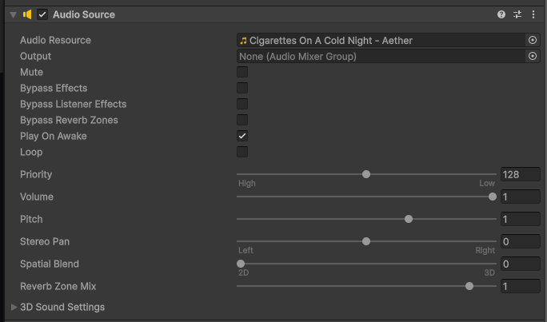

# plp-beat-tracker
<a href="https://youtu.be/XLxKawiX5rM">
    
</a>

This is the source code of a project I've made where, after reading a research paper, I create visualizations of the different steps that are part of a PLP Beat Tracking algorithm.

The [research](https://transactions.ismir.net/articles/10.5334/tismir.189) I'm referring to is
```
Peter Meier, Ching-Yu Chiu, and Meinard Müller
A Real-Time Beat Tracking System with Zero Latency and Enhanced Controllability
Transactions of the International Society for Music Information Retrieval (TISMIR), 7(1): 213–227, 2024
```

I explain how I coded the whole thing in a devlog on medium (I couldn't find any other website to upload it on): https://medium.com/@cupflowstudios/analyzing-real-time-audio-data-with-unity-plp-visualization-d550ebb72bcb. 
Please check it out if you're interested in this topic!

## How to try it out
You can see the visualizations yourself by either opening the project in unity or by downloading the executable from itch io.

### Executable
Download the latest build from itch io: https://cupflow-studios.itch.io/plp-beat-tracker-visualization.

Once you extract it and run the .exe file you should see:


1. PLP Visualization: It's the main visualization mode that shows the AudioData graph, the activation, the tempogram, and finally, the PLP graph. 
It also has a funny cat clapping his hands along beats with a stability greater than a certain threshold.

Once selected a file explorer will popup asking you which song you want, navigate to the desired folder and double click to select.


2. Microphone Mode PLP: It's basically the same thing but it will use your microphone instead of an audio file.

3. Frequency Graphs: A simple visualization I created to test out the graphs that shows how different frequency ranges change with time.


### Unity 
To open the project in unity, clone the repository and open the `BeatTracker` folder using Unity Hub.
Under `Assets/Scenes` you should find a scene called `PLPVisualization`. 
Open it and click the audiosource gameobject.

Here you can set which song to play (after importing it)

And before you hit the play button you can edit some settings from this component:
